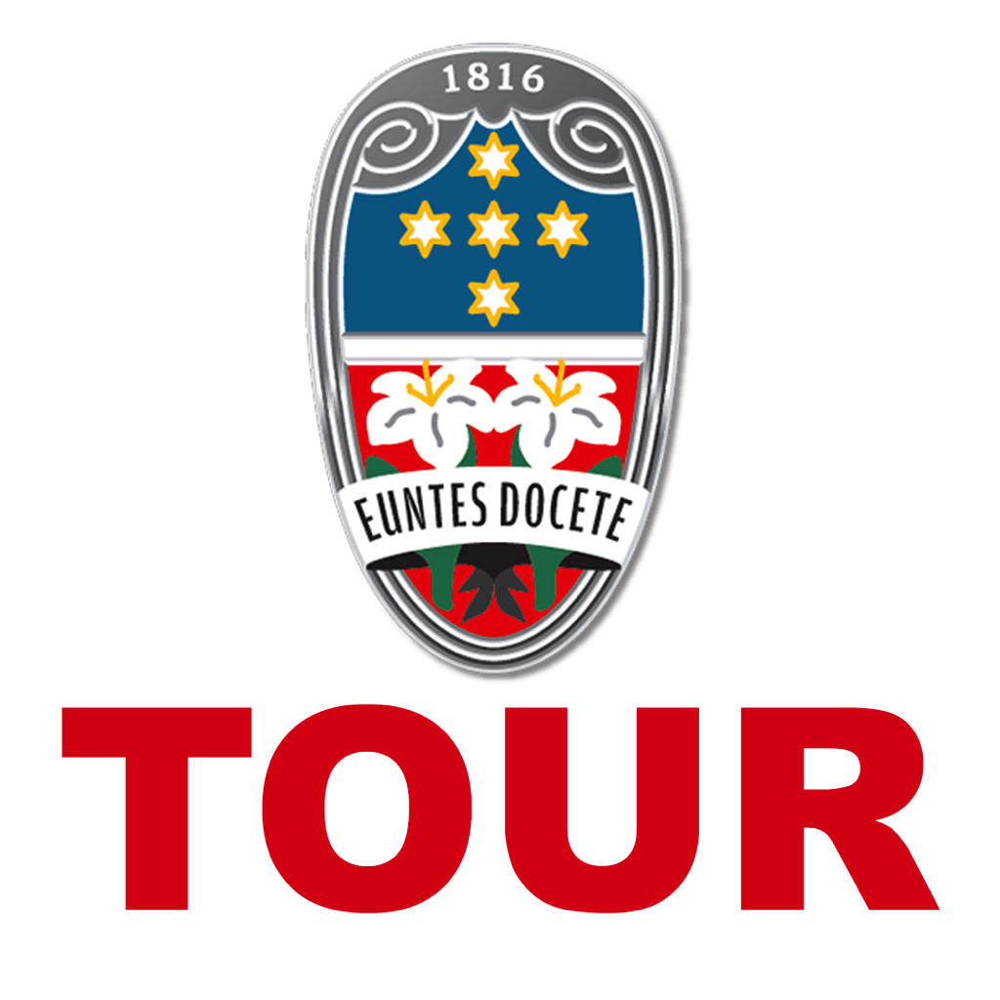

# Beacon Tour

This individual project aims to guide customers via a smartphone application through the building's corridors to obtain additional information about objects placed in the rooms using [Beacon](https://developer.apple.com/ibeacon/) technology.

It works like an audioguide with some additional features.

Created for [Scuole Alle Stimate](http://www.scuolestimate.it) during my high school journey. 

<!-- PROJECT LOGO -->
 

    

  <h3 align="center">Stimate Tour</h3>
   

Built with XCode for iOS platforms.

:warning: The code was written in 2017/2018, thus some libraries could be updated and the application has to be retested on the newer versions of iOS and XCode.

## Features
- Beacons are used for object identification
- 3 languages are available
- Feedback to guide people during the tour
- Provide images, descriptions (speech voice available for blind people) and map localization of the object identified by the Beacon
- This repo can be easily reused for another project, such as a museum or library.

## Disclaimer

This project is only for educational purposes. All the images and texts were provided by Scuole Alle Stimate.

## Acknowledgments
I thank Professor Carlo Tarallo for believing in my plans and supporting me throughout my high school and extracurricular activities. I appreciated all the efforts and passion he gave me.

I thank also Padre Simone and Gabriele Colombo (Resp. Div. Telecomunicazioni at AGSM Verona S.p.A.) for the opportunity to work on this project.